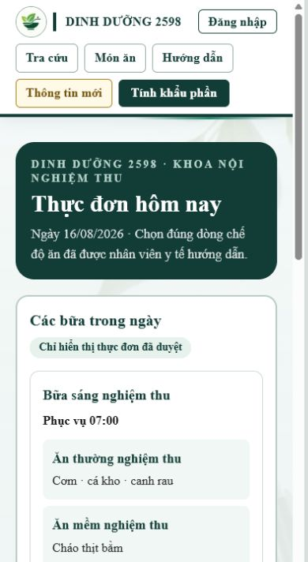
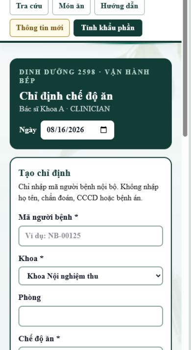
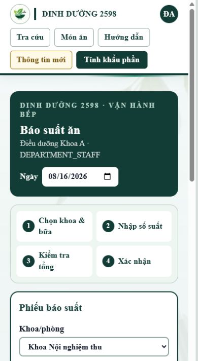

# Bằng chứng nghiệm thu báo ăn và chỉ định chế độ ăn

Ngày chạy: **16/08/2026** (Asia/Ho_Chi_Minh)  
Nhánh: `codex/bao-an-chi-dinh`

## Môi trường thử cô lập

- PostgreSQL 18 chạy cục bộ tại `127.0.0.1:55433`, database riêng `nutrition_acceptance`.
- Kết nối thử đặt `DATABASE_SSL=disable`; không dùng và không thay đổi DB dùng chung.
- Dữ liệu seed hoàn toàn giả: hai khoa `TEST-A`/`TEST-B`, bác sĩ, điều dưỡng, bếp, chuyên gia dinh dưỡng, loại bữa, chế độ ăn và thực đơn thử.
- Đã chạy `prisma migrate reset --force` trên đúng DB thử. Prisma áp thành công toàn bộ 18 migration, trong đó có hai migration cần áp khi nghiệm thu VPS:
  - `20260812090000_add_public_meal_reports`
  - `20260816090000_add_diet_orders`

Log migration cuối:

```text
Datasource "db": PostgreSQL database "nutrition_acceptance", schema "public" at "127.0.0.1:55433"
Applying migration `20260812090000_add_public_meal_reports`
Applying migration `20260816090000_add_diet_orders`
Database reset successful
```

## Kết quả 9 mục nghiệp vụ

Chạy bằng `npx tsx scripts/acceptance-bao-an.ts` sau khi seed:

```text
PASS 1/9 — Phạm vi khoa bác sĩ: CLINICIAN chỉ thấy khoa được gán qua DepartmentMembership.
PASS 2/9 — Tạo chỉ định: CLINICIAN tạo DietOrder trong khoa mình với cờ critical có cấu trúc.
PASS 3/9 — Chống chồng lấn: Chỉ định ACTIVE thứ hai cho cùng patientCode bị chặn.
PASS 4/9 — Chặn sai khoa: Bác sĩ/điều dưỡng khoa B không thao tác dữ liệu khoa A.
PASS 5/9 — Tách quyền: DEPARTMENT_STAFF không sửa chỉ định; CLINICIAN không chốt suất.
PASS 6/9 — Gợi ý và ghi chú lệch: Gợi ý=1; lệch không ghi chú bị chặn, có ghi chú được chốt.
PASS 7/9 — Hiệu lực theo ngày VN: Chỉ định ENDED không còn vào số gợi ý; ngày dùng dạng YYYY-MM-DD/localDate.
PASS 8/9 — Luồng bệnh nhân → điều dưỡng → bếp: Trang công khai chỉ xem; ghi chú RECEIVED chưa tới bếp, APPROVED mới hiển thị.
PASS 9/9 — Audit và tối thiểu dữ liệu: Có audit CREATE/END; diet_orders không có tên, chẩn đoán, CCCD hay bệnh án.
ACCEPTANCE_RESULT=9/9 PASS
```

## Gate kỹ thuật

```text
npm run test:diet-orders
DietOrder logic tests passed.

npx tsc --noEmit
PASS (exit 0)

npx eslint src/lib/prisma.ts scripts/acceptance-bao-an-seed.ts scripts/acceptance-bao-an.ts
PASS (exit 0)

npm run build
Compiled successfully
TypeScript passed
Generated static pages 86/86
PASS (exit 0)
```

## Ảnh kiểm tra mobile (khung nhìn 390 px)

### Trang thực đơn công khai cho bệnh nhân



### Màn bác sĩ chỉ định chế độ ăn



### Màn điều dưỡng báo suất ăn



Các ảnh dùng dữ liệu giả trong DB thử. Harness chỉ phục vụ tạo viewport nghiệm thu và không được đưa vào sản phẩm.
