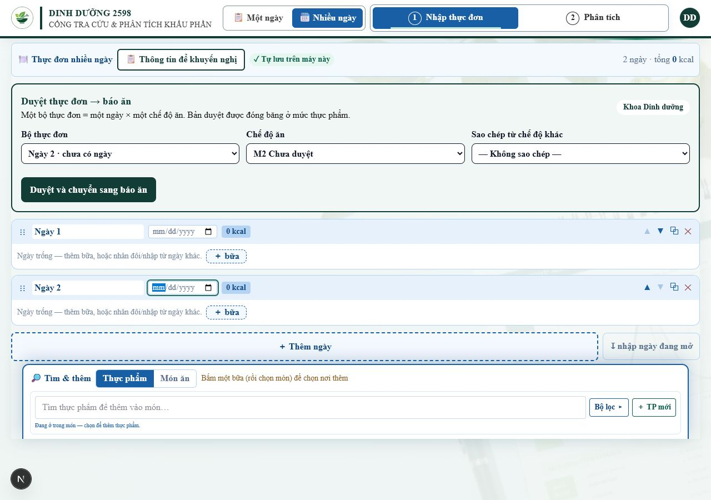
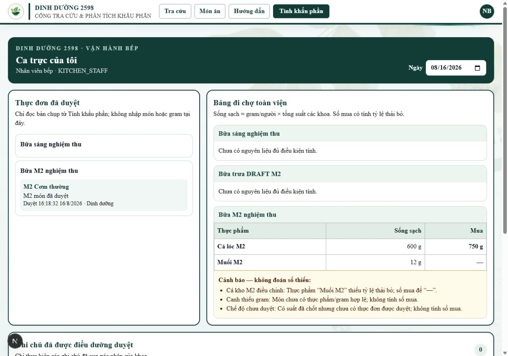
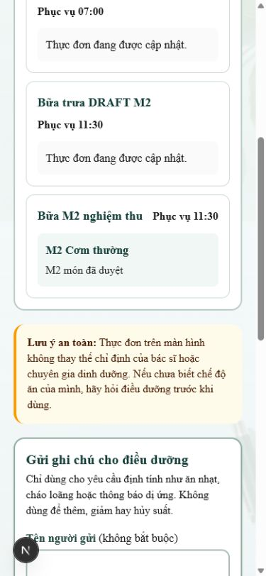

# Bằng chứng nghiệm thu M2 v2 — cầu nối thực đơn → báo ăn/đi chợ

Ngày chạy: **16/08/2026** (Asia/Ho_Chi_Minh)  
Nhánh: `codex/m2-rap-thuc-don`

## Môi trường DB thử cô lập

- PostgreSQL 18 cục bộ tại `127.0.0.1:55433`, database riêng `nutrition_acceptance` của nghiệm thu M1.
- `DATABASE_SSL=disable`; không dùng, không migrate và không thay đổi DB dùng chung.
- Áp migration bằng `prisma migrate deploy`, không reset DB.
- Nghiệm thu lần đầu phát hiện dữ liệu M1 có nhiều `KitchenMenuItem` cùng `(menuId, dietTypeId)`. Migration đã được sửa để **không tạo unique index, không dedupe/xóa dữ liệu M1**; API cập nhật item hiện hữu hoặc tạo mới.

Log migration cuối:

```text
Datasource "db": PostgreSQL database "nutrition_acceptance", schema "public" at "127.0.0.1:55433"
19 migrations found in prisma/migrations
Applying migration `20260816193000_add_kitchen_menu_snapshots`
The following migration(s) have been applied:
  20260816193000_add_kitchen_menu_snapshots/migration.sql
All migrations have been successfully applied.
```

## Nghiệm thu DB/API thật

Chạy `npx tsx scripts/acceptance-m2-snapshot.ts` trên app local kết nối DB thử:

```text
PASS 1/9 — Có dòng M1 null: duyệt lần đầu tạo đúng một dòng approved riêng và giữ nguyên dòng legacy.
PASS 2/9 — Duyệt lại cập nhật đúng dòng approved; vẫn chỉ một dòng approved và không đụng A legacy/B.
PASS 3/9 — Đi chợ không nhân đôi snapshot: 2+4 suất cho cá 600 g sống sạch, 750 g mua; thiếu % thải bỏ để —.
PASS 4/9 — Chế độ có suất nhưng chưa duyệt và món thiếu gram đều cảnh báo, không tính số đoán.
PASS 5/9 — KITCHEN_STAFF chỉ nhận item approvedAt khác null.
PASS 6/9 — Trang bệnh nhân chỉ hiện item được duyệt.
PASS 7/9 — Duyệt và duyệt lại đều có audit ở item; KitchenMenu.status chỉ là trạng thái hiển thị.
PASS 8/9 — Dòng M1 null cùng (bữa × chế độ) không được nâng cấp và không đi vào số mua.
PASS 9/9 — Migration M2 có đủ snapshotJson/approvedAt/approvedById trên DB thử cô lập.
ACCEPTANCE_M2_RESULT=9/9 PASS
```

Harness seed dữ liệu giả cho hai khoa `TEST-A`/`TEST-B`, hai chế độ M2 và tài khoản giả DIETITIAN/DEPARTMENT_STAFF/KITCHEN_STAFF. Ca hồi quy tạo sẵn một dòng M1 `approvedAt = null` cùng `(bữa × chế độ)`, duyệt rồi duyệt lại để xác nhận API luôn tạo/cập nhật đúng một dòng đã duyệt và bảng đi chợ không cộng snapshot hai lần. Không chứa dữ liệu người bệnh thật.

## Gate kỹ thuật

```text
npm run test:kitchen-snapshot
PASS kitchen menu snapshot × suất toàn viện

npm run test:diet-orders
DietOrder logic tests passed.

npx tsc --noEmit
PASS (exit 0)

npx eslint <toàn bộ file M2 + hai script test/acceptance>
PASS (exit 0)

npm run build -- --webpack
Compiled successfully
TypeScript passed
Generated static pages 87/87
PASS (exit 0)
```

Build dùng webpack vì worktree nghiệm thu dùng junction `node_modules`; Turbopack từ chối symlink nằm ngoài filesystem root. Đây là giới hạn môi trường worktree, không phải lỗi biên dịch ứng dụng.

## Ảnh UI đúng thiết bị

### Desktop 1280 px — khoa Dinh dưỡng: ngày × chế độ, copy và duyệt-chuyển



### Desktop 1280 px — bếp: item đã duyệt, bảng đi chợ và cảnh báo

Ảnh xác nhận trực quan cá 600 g sống sạch/750 g mua; muối thiếu `% thải bỏ` để `—`; chế độ chưa duyệt và món thiếu gram đều có cảnh báo.



### Mobile 390 px — trang bệnh nhân

Chỉ `M2 Cơm thường / M2 món đã duyệt` xuất hiện; item `M2 món chưa duyệt` không được render.



## Không thực hiện

- Không merge.
- Không deploy.
- Không migrate DB dùng chung/VPS.
