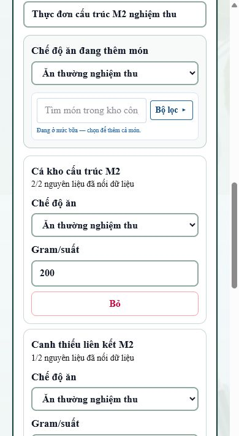
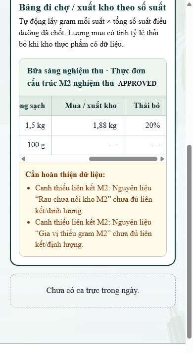
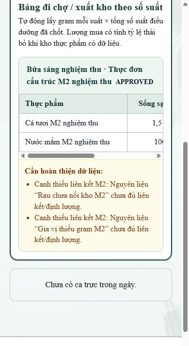

# Bằng chứng nghiệm thu M2 — thực đơn cấu trúc và bảng đi chợ

Ngày chạy: **16/08/2026** (Asia/Ho_Chi_Minh)  
Nhánh: `codex/bao-an-m2`  
Base: `main` tại merge commit M1 `b4f9462`

## Môi trường thử cô lập

- PostgreSQL 18 chạy cục bộ tại `127.0.0.1:55433`, database riêng `nutrition_acceptance`.
- Kết nối local đặt `DATABASE_SSL=disable`; không dùng DB chung và không deploy VPS.
- Seed hoàn toàn giả: khoa, tài khoản, bữa ăn, chế độ ăn, Food, Dish và DishIngredient thử nghiệm.
- Food thử gồm một dòng `wastePercent=20` và một dòng `wastePercent=null`.
- Dish thử có `totalWeightG`, nguyên liệu đủ `quantityG + foodId`, cùng một món cố ý thiếu liên kết/gram để kiểm tra cảnh báo.

Prisma áp migration thành công trên DB thử:

```text
Applying migration `20260812090000_add_public_meal_reports`
Applying migration `20260816090000_add_diet_orders`
Applying migration `20260816160000_add_structured_kitchen_menu`
Database reset successful
```

Không áp migration lên DB dùng chung. Khi deploy M2, migration mới cần áp sau M1 là:

```text
20260816160000_add_structured_kitchen_menu
```

## Kết quả nghiệm thu nghiệp vụ

Chạy `npx tsx scripts/acceptance-m2.ts` qua live Next.js server và PostgreSQL thử:

```text
PASS 1/6 — Soạn thực đơn cấu trúc: DIETITIAN chọn Dish từ kho và lưu gram/suất; menu ở trạng thái DRAFT.
PASS 2/6 — Ẩn bản nháp với bếp: KITCHEN_STAFF không nhận menu DRAFT trong operationsContext.
PASS 3/6 — Duyệt và tính bảng đi chợ: 10 suất × công thức scale 200/400: cá sống sạch 1.500 g, mua 1.875 g; nước mắm 100 g và mua=— do thiếu % thải bỏ.
PASS 4/6 — Không đoán dữ liệu thiếu: Nguyên liệu thiếu liên kết/gram vào khối cảnh báo và không sinh số lượng giả.
PASS 5/6 — Phân quyền menu: Bếp thấy menu APPROVED nhưng không thấy menu DRAFT cùng ngày.
PASS 6/6 — Tương thích M1 và migration: Trang bệnh nhân vẫn render dishName cũ; hai cột M2 tồn tại sau migration.
M2_ACCEPTANCE_RESULT=6/6 PASS
```

Phép tính được assert trực tiếp:

```text
Cá: 300 g/công thức × (200 g/suất ÷ 400 g/công thức) × 10 suất = 1.500 g sống sạch
Mua cá: 1.500 ÷ (1 - 20%) = 1.875 g
Nước mắm: 20 × (200 ÷ 400) × 10 = 100 g; thiếu wastePercent ⇒ mua = null/“—”
```

## Gate kỹ thuật

```text
npm run test:kitchen-shopping
Kitchen shopping list tests passed.

npx prisma validate
The schema at prisma/schema.prisma is valid.

npx tsc --noEmit
PASS (exit 0)

npx eslint scripts/test-kitchen-shopping.ts scripts/acceptance-m2-seed.ts scripts/acceptance-m2.ts src/app/api/meal-operations/route.ts src/app/meal-operations/OperationsApp.tsx src/lib/kitchen-shopping.ts src/lib/meal-operations.ts
PASS (exit 0)

npm run build
Compiled successfully
TypeScript passed
Generated static pages 86/86
PASS (exit 0)
```

## Ảnh mobile 390 px

### Soạn thực đơn: chọn món từ kho và nhập gram/suất



### Bảng đi chợ của KITCHEN_STAFF: chỉ menu APPROVED, cột mua và thải bỏ



### Dữ liệu thiếu: hiện cảnh báo, không sinh số đoán



Các ảnh dùng dữ liệu giả. Harness 390 px chỉ phục vụ chụp nghiệm thu và không được đưa vào sản phẩm.
