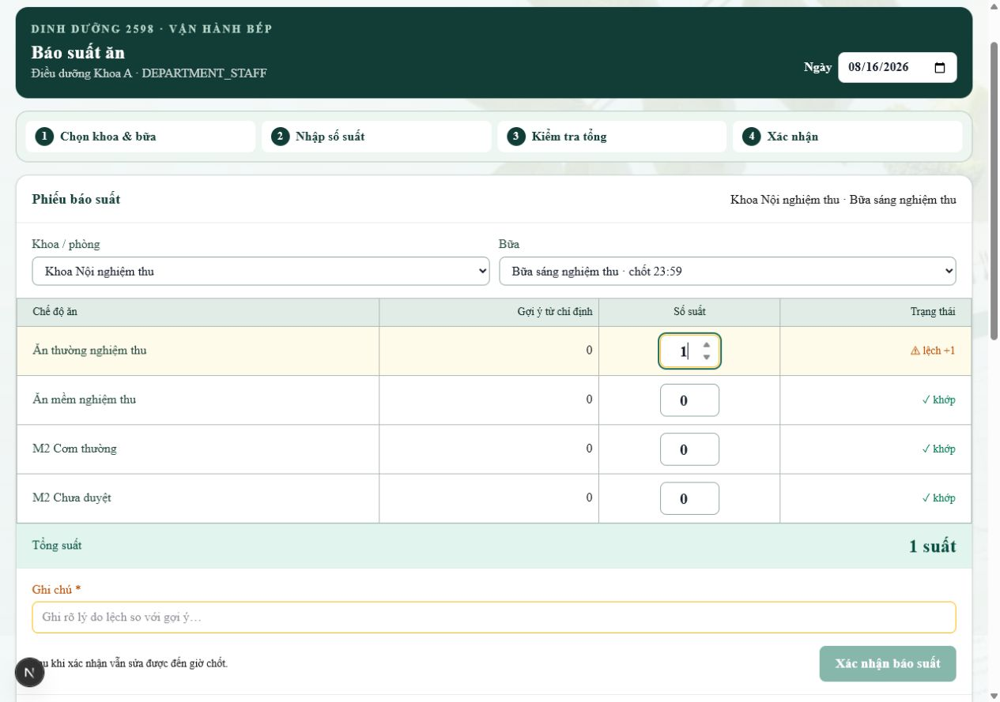
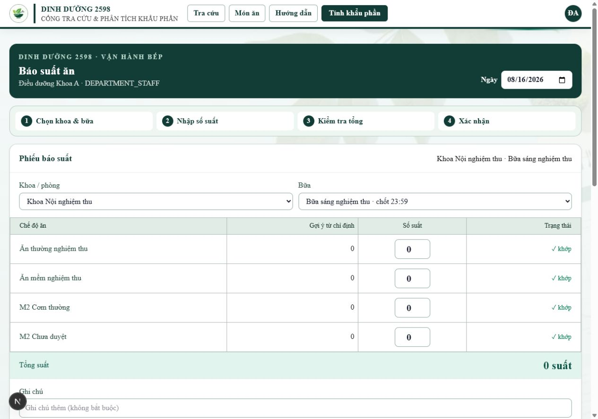
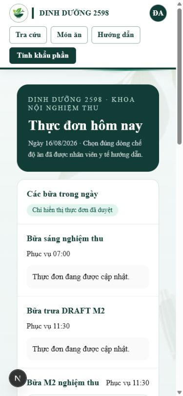
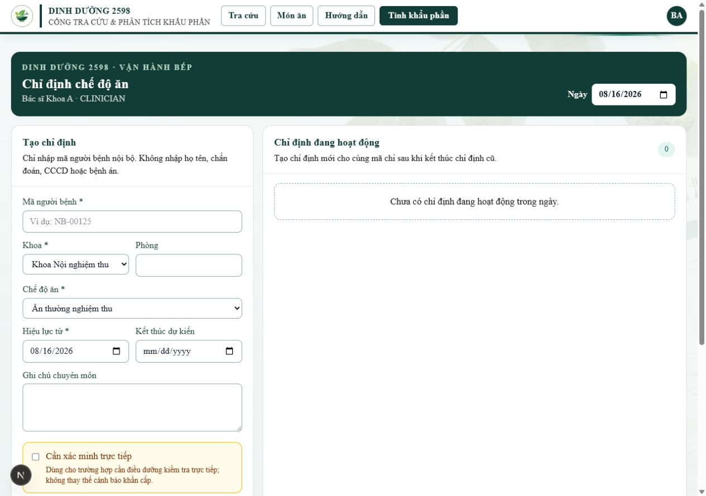
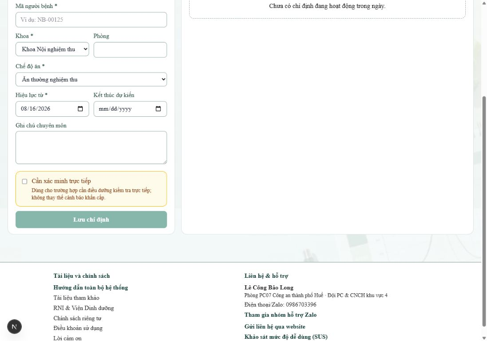
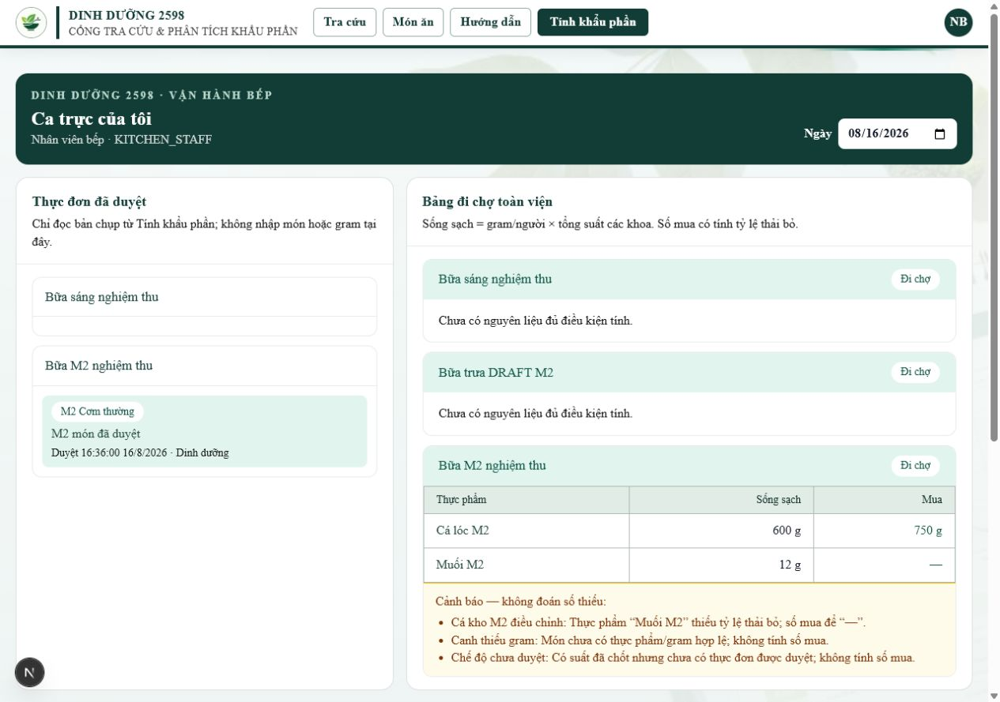
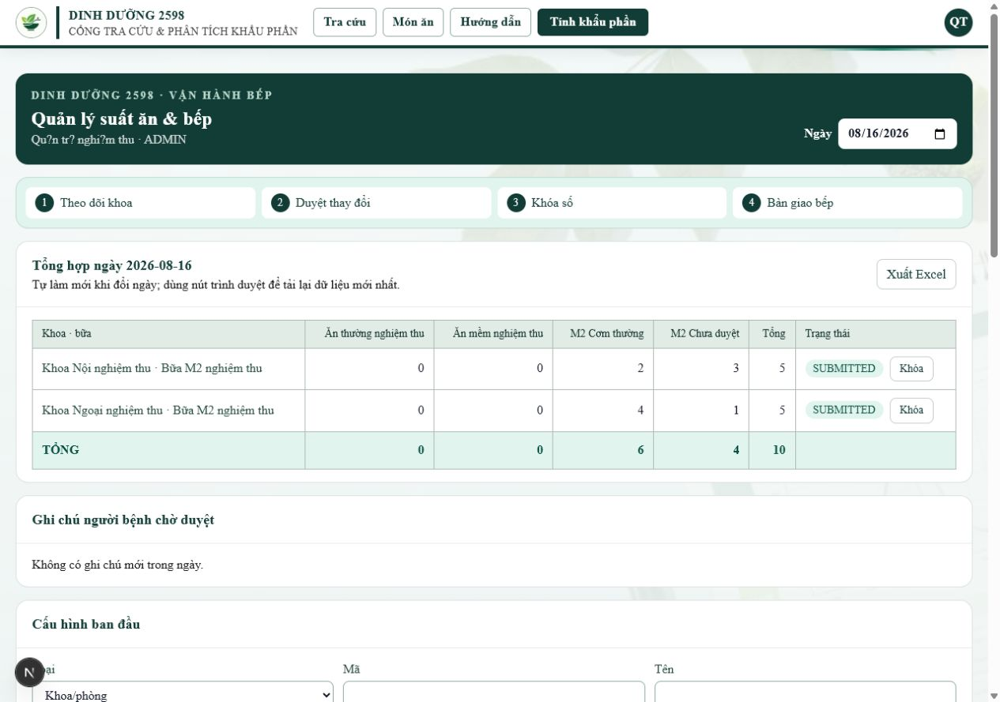
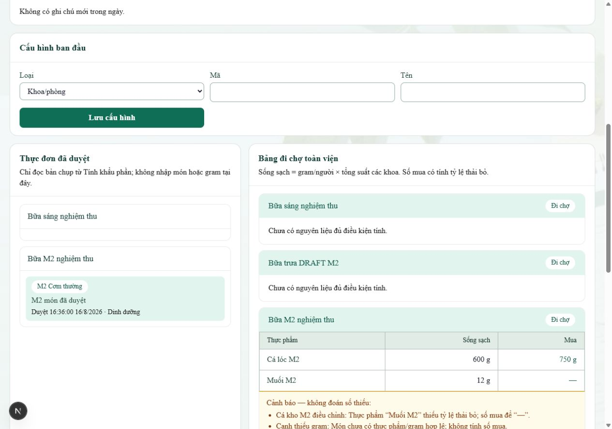
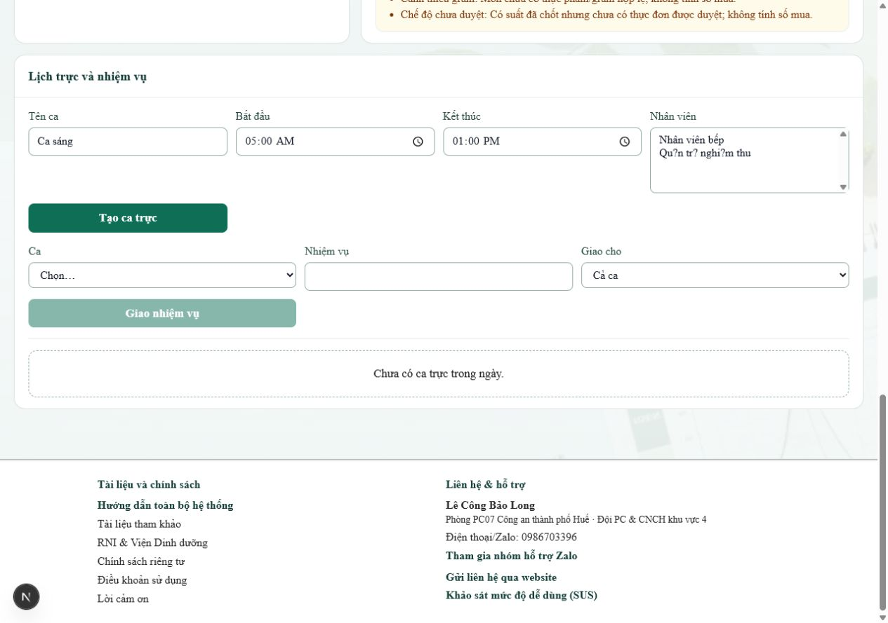

# Bằng chứng render UI báo suất điều dưỡng

Ngày kiểm tra: **16/08/2026** (Asia/Ho_Chi_Minh)  
Nhánh: `claude/ui-bao-suat` · commit giao kiểm tra: `162e504`

## Môi trường

- App local tại `http://127.0.0.1:3103`, viewport desktop `1280 × 900`.
- PostgreSQL thử cô lập tại `127.0.0.1:55433`, database `nutrition_acceptance`.
- Đăng nhập bằng tài khoản giả `DEPARTMENT_STAFF` của nghiệm thu; không dùng dữ liệu người bệnh thật.
- Không migrate DB dùng chung, không deploy.

## Kết quả đối chiếu

- Bảng hiển thị đủ 4 cột: **Chế độ ăn · Gợi ý từ chỉ định · Số suất · Trạng thái**.
- Dòng khớp hiển thị badge `✓ khớp`.
- Nhập `1` khi gợi ý là `0`: dòng chuyển nền hổ phách và hiện badge `⚠ lệch +1`.
- Dải **Tổng suất** nền xanh nhạt cập nhật thành `1 suất`.
- Khi lệch, trường đổi thành **Ghi chú \***, placeholder yêu cầu ghi lý do và nút **Xác nhận báo suất** bị khóa khi ghi chú trống.
- Nhập lý do thử nghiệm làm nút xác nhận được mở; không bấm xác nhận nên không ghi phiếu mới vào DB.
- Không thấy vỡ bảng, tràn chữ hoặc chồng control ở viewport desktop.

## Render bổ sung và đồng bộ design-language

Các ảnh dưới đây được render sau khi chỉ thay lớp giao diện của `DoctorPanel` và
`SnapshotMenuPanel`; handler, payload và luồng nghiệp vụ được giữ nguyên.

### Điều dưỡng · desktop 1280 px

### Người bệnh · mobile 390 px

### Bác sĩ · desktop 1280 px

- Thẻ và dải tiêu đề dùng viền hairline; nhãn/input/nút theo token chung.
- Cảnh báo không nhập PII vẫn giữ nguyên.
- Danh sách chỉ định đang hiệu lực dùng badge và thẻ sạch; ảnh phụ xác nhận vùng
  cảnh báo amber và nút chính teal ở cuối form.

### Bếp · desktop 1280 px

- Thực đơn duyệt, badge chế độ ăn và dải từng bữa dùng nền xanh nhạt.
- Bảng đi chợ có header hairline, số căn phải/tabular và số mua thiếu dữ liệu để `—`.
- Giữ đủ ba cảnh báo: thiếu tỷ lệ thải bỏ, món thiếu gram và chế độ chưa duyệt.

## Quản trị suất ăn · desktop 1280 px

Render bằng tài khoản giả `ADMIN` trên DB thử cô lập. Sáu khối admin giữ nguyên
luồng nghiệp vụ và được đồng bộ về thẻ hairline, dải tiêu đề, chữ vừa, input một
viền và nút teal/viền.

- `Summary` là khối trung tâm: bảng khoa × bữa × chế độ, số căn phải/tabular,
  badge trạng thái, nút `Khóa`/`Xuất Excel` và dòng `TỔNG` xanh nhạt.
- `PublicNoteReview` giữ trạng thái chờ duyệt màu amber; dữ liệu thử hiện không có
  ghi chú mới nên ảnh thể hiện empty state.
- `ConfigPanel`, `SnapshotMenuPanel` và `ShiftPanel` cùng nhịp viền/khoảng cách;
  ba cảnh báo đi chợ vẫn giữ nguyên.

